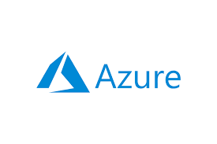

## Azure and Terraform

<p align="center" style="display: flex; justify-content: center; gap: 150px;">
   
   
</p>

## Installation and Execution Steps


Clone the respository

```bash
https://github.com/uchiha-vivek/Terraform-Azure-Scripts.git
cd Terraform-Azure-Scripts
```

Login into Azure from the terminal

```bash
az login
az account set --subscription "<subscription-id>"
```

Intialize the terraform project

```bash
terraform init
```

Preview infrastructure

```bash
terraform plan
```

Deploy

```bash
terraform deploy
```

If you want to destroy the changes

```bash
terraform destroy
```


## Explaination of `Main File`

Terraform Configuration Block

```bash
terraform {
  required_providers {
    azurerm = {
      source  = "hashicorp/azurerm"
      version = "~> 3.0"
    }
  }

  required_version = ">= 1.5.0"
}
```


Provider Block

```bash
provider "azurerm" {
  features {}
}

```

- Its used for connecting `Terraform` to `Azure`


Resource Group Name

```bash
resource "azurerm_resource_group" "rg" {
  name     = var.resource_group_name
  location = var.location
}
```

- the above values are taken from `variables.tf`


Service you are using (Here App Service plan for my case)

```bash
resource "azurerm_service_plan" "app_service_plan" {
  name                = var.app_service_plan_name
  resource_group_name = azurerm_resource_group.rg.name
  location            = azurerm_resource_group.rg.location
  os_type             = "Linux"
  sku_name            = "B1" # Basic Tier
}

```


Creating Web app instance 

```bash
resource "azurerm_linux_web_app" "web_app" {
  name                = var.web_app_name
  resource_group_name = azurerm_resource_group.rg.name
  location            = azurerm_resource_group.rg.location
  service_plan_id     = azurerm_service_plan.app_service_plan.id

  site_config {
    application_stack {
      node_version = "18-lts"
    }
  }

  https_only = true
}
```


URL of the web app

```bash
output "webapp_url" {
  value = azurerm_linux_web_app.web_app.default_hostname
  description = "The default URL of the Web App"
}
```

- After web app service is created, you get the azure hosted url link


### Important point to understand

- __App Service__ is the overall platform that runs Web Apps, Function Apps, API Apps, etc.
- A __Web App__ is a type of __App Service__


## Explaination of `variables.tf`


- Location of the Resource Group

```bash
variable "location" {
  description = "Azure location for the resources"
  default     = "East US 2"
}

```

- Resource Group Name

```bash
variable "resource_group_name" {
  description = "Resource Group name"
  default     = "terraform-backend-api-testing"
}
```

- App Service plan

```bash
variable "app_service_plan_name" {
  description = "App Service Plan name"
  default     = "my-app-service-plan-terraform"
}
```

- Web App name

```bash
variable "web_app_name" {
  description = "Web App name (must be globally unique)"
  default     = "my-simple-webapp12345-terraform"
}
```

These values from `variables.tf` are used in `main.tf`


## Azure Commands you require

`az login` - Log in to your Azure account

`az account list --output table` - Show all available subscriptions


`az account set --subscription "<subscription-id>"` - Select the active subscription for Terraform to use


If you want service principal:

`az ad sp create-for-rbac --name "my-tf-sp" --role Contributor --scopes /subscriptions/<subscription-id>` - Create a service principal (for automation / CI/CD)


Viewing all existing resource groups

`az group list --output table`


## Terraform core commands


`terraform init` - Initialize Terraform & download Azure provider plugins

`terraform plan` - Preview what resources will be created/changed/destroyed

`terraform apply` - create or update resources in Azure

`terraform output` - Show values defined in output blocks

`terraform show` - Display the current Terraform state in human-readable form

`terraform state list` - List all resources currently tracked by Terraform

`terraform destroy` - Delete all Terraform-managed resources

